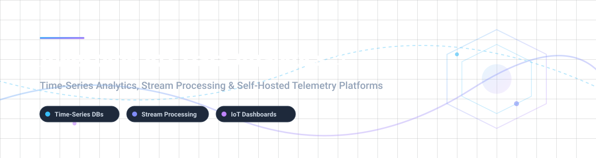

  

# ⚡ Awesome IoT Data Analytics

  
  
  
  
  

## 🌐 Top IoT Data Analytics Ecosystem

**Curated List of Enterprise SaaS Products & Open-Source GitHub Projects**  
*Focused on Time-Series Analytics, Stream Processing, Industrial IoT (IIoT) Telemetry & Self-Hosted IoT Data Platforms*  

**📅 Last updated: October 2026**

---

### 🔍 Search Keywords & Topic Tags
`iot-data-analytics` • `time-series-database` • `stream-processing` • `industrial-iot` • `telemetry-analytics` • `iiot-platform` • `thingsboard` • `grafana-dashboards` • `apache-flink` • `tdengine`

---

This repository tracks notable **commercial IoT data analytics platforms** and **open-source projects** that ingest, store, analyze, and visualize device telemetry at scale — powering predictive maintenance, anomaly detection, operational dashboards, and industrial intelligence.

**Top Commercial Leaders**: Microsoft Azure Stream Analytics, Google Cloud IoT Analytics, AWS IoT Analytics, AWS IoT SiteWise, Datadog IoT, PTC ThingWorx, Samsara, Software AG Cumulocity IoT, ClearBlade, and Omnition IoT.

---

## 📑 Table of Contents

- [📊 Sector Market Overview & Dynamics](#-sector-market-overview--dynamics)
- [☁️ SaaS/Hosted Platforms](#️-saashosted-platforms)
- [🔓 Open-Source GitHub Projects](#-open-source-github-projects)
  - [🏢 IoT Platforms & Frameworks](#-iot-platforms--frameworks)
  - [📈 Business Intelligence & Visualization](#-business-intelligence--visualization)
  - [⚡ Stateful Stream Processing](#-stateful-stream-processing)
  - [⏰ Time-Series & Analytical Databases](#-time-series--analytical-databases)
  - [🛠️ Data Pipeline & Ingestion Tools](#️-data-pipeline--ingestion-tools)
- [🤝 How to Contribute](#-how-to-contribute)
- [❤️ Support & Sponsorship](#️-support--sponsorship)
- [⚠️ Disclaimer](#%EF%B8%8F-disclaimer)
- [⭐ Star History](#-star-history)

---

## 📊 Sector Market Overview & Dynamics

> **Market Size & Structure**: The global IoT Data Analytics market size is estimated at **$28.5 Billion in 2026** and is projected to reach **$72.4 Billion by 2031**, growing at a CAGR of ~20.5%.
> 
> **Market Fragmentation**: The sector is **moderately fragmented** with strong hyper-scaler cloud concentration (AWS, Azure, GCP) leading standard cloud-native ingestion, alongside specialized vertical domain leaders (Samsara for fleet telematics, PTC ThingWorx for IIoT asset modeling). Rather than a single "winner-take-all" outcome, the market has bifurcated into proprietary enterprise cloud suites and a vibrant, highly popular open-source time-series/stream-processing ecosystem (ThingsBoard, Grafana, Superset, TDengine, Apache Flink).

---

## ☁️ SaaS/Hosted Platforms

| Platform / Product | Company Size / Revenue / Valuation | Starting Price | Free Tier / Trial Limit | Key Features & Focus |
| :--- | :--- | :--- | :--- | :--- |
| **[Microsoft Azure Stream Analytics](https://azure.microsoft.com/en-us/products/stream-analytics/)** ☁️ | **Microsoft**: ~$3.1T Valuation / ~$245B Annual Revenue | $0.11 / Streaming Unit-hour | 30-day free trial ($200 Azure credits) | Sub-millisecond real-time stream analytics on sensor data with built-in ML and temporal joins. |
| **[Google Cloud IoT Analytics](https://cloud.google.com/solutions/iot)** ☁️ | **Alphabet / Google**: ~$2.1T Valuation / ~$307B Annual Revenue | $6.25 / TB scanned (BigQuery) + $0.04 / slot-hr (Dataflow) | 90-day free trial ($300 Google Cloud credits) + 1 TB/mo query free | Serverless data ingestion, streaming ETL (Dataflow), BigQuery analytics, and Looker dashboards. |
| **[AWS IoT Analytics](https://aws.amazon.com/iot-analytics/)** ☁️ | **Amazon / AWS**: ~$1.9T Valuation / ~$105B AWS Revenue | $0.05 / GB processed + $0.023 / GB-month storage | 12-month free tier via new AWS account ($200 credits) | Managed IoT data pipeline, channel ingestion, automated dataset generation, and SQL querying. *(Legacy for existing accounts)* |
| **[AWS IoT SiteWise](https://aws.amazon.com/iot-sitewise/)** 🏭 | **Amazon / AWS**: ~$1.9T Valuation / ~$105B AWS Revenue | $0.50 / 1M calculations + $10 / user-month (SiteWise Monitor) | Free Edge Data Collection Pack; pay per usage for cloud ingestion | Industrial asset modeling, equipment metrics calculation, real-time edge-to-cloud data collection. |
| **[Datadog IoT](https://www.datadoghq.com/)** 📈 | **Datadog**: ~$98B Valuation / ~$4.46B Annual Revenue | $15 / host per month (Pro tier, annual commit) | 14-day free trial (Full platform access) | Unified observability, device fleet health monitoring, custom telemetry metrics, and log aggregation. |
| **[PTC ThingWorx](https://www.ptc.com/)** 🏭 | **PTC**: ~$23.7B Enterprise Value (Acquired by Schneider Electric) / ~$2.7B Revenue | $10,000 / year (Enterprise deployment quote baseline) | Contact sales for demo/pilot (No public self-service free trial) | End-to-end industrial IoT platform, AR connectivity, predictive analytics, and enterprise asset tracking. |
| **[Samsara](https://www.samsara.com/)** 🚛 | **Samsara**: ~$24B Valuation / ~$2.1B ARR | $27 / vehicle per month ($99-$148 hardware upfront) | 30-day trial window (Full return policy evaluation period) | Commercial fleet telematics, connected equipment operations, real-time GPS tracking, and AI video safety. |
| **[Cumulocity IoT](https://cumulocity.com/)** 🏢 | **Cumulocity / Software AG**: ~$1B Valuation / ~$1.08B Parent Revenue | $250 / month (Standard business tier starter base) | 30-day free trial (Up to 10 connected devices max) | Cloud-native enterprise AIoT management, Apama complex event processing, and edge computing analytics. |
| **[ClearBlade](https://clearblade.com/)** ⚡ | **ClearBlade**: ~$19M Funding / ~$8M Annual Revenue | $0.25 / GB processed ($25,000/yr enterprise base) | Always Free Tier up to 250 MB data transferred per month | Scalable IoT Core replacement, edge computing rules engine, stream data processing, and asset monitoring. |
| **[Omnition IoT (Splunk/Cisco)](https://www.omnition.io/)** 🔍 | **Splunk / Cisco**: ~$260B Cisco Valuation (Acquired Splunk/Omnition) | Billed via Cisco AppDynamics / Splunk Observability ($60/host/mo) | 14-day free trial via Splunk Observability Cloud | Distributed tracing and microservice observability for IoT cloud backends and device gateways. |

---

## 🔓 Open-Source GitHub Projects

All open-source telemetry and stream processing options below are sorted descending by **GitHub Stars_Counts** ⭐.

### 🏢 IoT Platforms & Frameworks

- **[ThingsBoard](https://github.com/thingsboard/thingsboard)**  👑  
  **The most popular open-source IoT platform** (Apache-2.0). Provides device management, data collection, complex event processing, and customizable analytics dashboards. Features a visual Rule Engine for data processing workflows, alarm triggers, and device state management. Supports MQTT, CoAP, HTTP, and LwM2M protocols with multi-tenancy.

- **[Node-RED](https://github.com/node-red/node-red)**  🔌  
  **Low-code programming for event-driven IoT applications** (JS Foundation / Apache-2.0). Provides a browser-based flow editor for wiring together hardware devices, APIs, and online services with real-time data visualizers.

- **[Magistrala](https://github.com/absmach/magistrala)**  ⚡  
  **Modern, Go-based, cloud-native IoT platform framework** (formerly Mainflux, Apache-2.0). Designed for high-throughput sensor telemetry ingestion, fine-grained RBAC policies, containerized microservices, and edge computing nodes.

---

### 📈 Business Intelligence & Visualization

- **[Grafana](https://github.com/grafana/grafana)**  📊  
  **The de facto standard for open-source observability dashboards** (AGPL-3.0). Connects to 100+ telemetry data sources (Prometheus, InfluxDB, TDengine, PostgreSQL, TimescaleDB). Features real-time alerting, multi-tenant dashboards, and high-density panel rendering.

- **[Apache Superset](https://github.com/apache/superset)**  📉  
  **Modern enterprise data exploration and visualization platform** (Apache-2.0). Features a fast SQL IDE, no-code chart builder, rich Jinja templating, and native integration with time-series databases for IoT analytics.

- **[Metabase](https://github.com/metabase/metabase)**  ❓  
  **Easy self-service business intelligence and analytics** (AGPL-3.0). Allows non-technical teams to filter, query, and chart telemetry data via a no-code interface.

- **[Redash](https://github.com/getredash/redash)**  🔍  
  **SQL-driven collaborative dashboard platform** (BSD-2-Clause). Connect and query high-cardinality data sources with shareable visualizations and automated alerts.

---

### ⚡ Stateful Stream Processing

- **[Apache Spark](https://github.com/apache/spark)**  💥  
  **Unified engine for large-scale data processing & Structured Streaming** (Apache-2.0). Processes massive IoT data streams with micro-batch or continuous processing, watermarking, and machine learning models.

- **[Apache Kafka](https://github.com/apache/kafka)**  🌊  
  **Distributed event streaming platform** (Apache-2.0). Provides high-throughput pub/sub channels, durable log storage, and Kafka Streams API for real-time telemetry pipelines.

- **[Apache Flink](https://github.com/apache/flink)**  🏃  
  **Stateful stream processing framework** (Apache-2.0). Industry standard for low-latency complex event processing (CEP), out-of-order event time handling, and exactly-once state guarantees.

- **[Apache Beam](https://github.com/apache/beam)**  🔀  
  **Unified batch and stream processing programming model** (Apache-2.0). Portable pipeline definition execution across Flink, Spark, and Google Cloud Dataflow.

- **[ksqlDB](https://github.com/confluentinc/ksql)**  🔤  
  **Streaming SQL engine for Apache Kafka** (Confluent Community License). Build real-time stream processing applications using familiar SQL syntax for filtering, joins, and windowed aggregates.

---

### ⏰ Time-Series & Analytical Databases

- **[ClickHouse](https://github.com/ClickHouse/ClickHouse)**  🚀  
  **Ultra-fast open-source columnar database management system** (Apache-2.0). Delivers sub-second SQL analytical queries over billions of IoT telemetry records with compression.

- **[InfluxDB](https://github.com/influxdata/influxdb)**  ⏱️  
  **Leading open-source time-series platform** (MIT/Apache-2.0). Engineered for metrics, events, and real-time analytics with optimized storage compression.

- **[TDengine](https://github.com/taosdata/TDengine)**  ⚙️  
  **Purpose-built time-series database for IoT and Industrial IoT** (AGPL-3.0). Employs a single-table-per-device architecture for extreme ingestion rates and downsampling query speed.

- **[TimescaleDB](https://github.com/timescale/timescaledb)**  📅  
  **Relational time-series database built on PostgreSQL** (Apache-2.0/Timescale License). Offers full SQL support, automatic hypertable partitioning, continuous aggregates, and columnar compression.

- **[QuestDB](https://github.com/questdb/questdb)**  ⚡  
  **High-performance SQL time-series database** (Apache-2.0). SIMD-optimized query execution and fast InfluxDB Line Protocol ingestion for real-time sensor streams.

- **[VictoriaMetrics](https://github.com/VictoriaMetrics/VictoriaMetrics)**  📉  
  **Fast, cost-effective, and scalable time-series database** (Apache-2.0). Prometheus-compatible metrics storage with superior data compression rates.

- **[Apache Druid](https://github.com/apache/druid)**  💧  
  **Real-time analytical database** (Apache-2.0). Designed for sub-second OLAP queries on event-driven telemetry and streaming data sets.

- **[Apache Pinot](https://github.com/apache/pinot)**  🍷  
  **Real-time distributed OLAP datastore** (Apache-2.0). Used for low-latency user-facing analytics and real-time device telemetry dashboards.

- **[Apache IoTDB](https://github.com/apache/iotdb)**  🏭  
  **High-performance IoT-native time-series database** (Apache-2.0). Optimized for tree-structured device management, efficient file formats (TsFile), and edge-cloud sync.

---

### 🛠️ Data Pipeline & Ingestion Tools

- **[Vector](https://github.com/vectordotdev/vector)**  🛡️  
  **High-performance observability data pipeline** (MPL-2.0). Collects, transforms, and routes logs and metrics with minimal memory footprint.

- **[Fluentd](https://github.com/fluent/fluentd)**  🪵  
  **Data collector for unified logging layer** (Apache-2.0). Pluggable architecture to aggregate device logs and stream into backend time-series databases.

- **[Fluent Bit](https://github.com/fluent/fluent-bit)**  🪶  
  **Super lightweight log and metrics processor for Linux & IoT Edge** (Apache-2.0). Ideal for constrained edge devices and embedded gateways.

- **[Apache NiFi](https://github.com/apache/nifi)**  🌊  
  **Automated data flow and telemetry routing system** (Apache-2.0). Features visual drag-and-drop flow design, data provenance tracing, and edge node distribution (MiNiFi).

- **[Benthos (Redpanda Connect)](https://github.com/redpanda-data/connect)**  🐙  
  **Resilient stream processor without code** (Apache-2.0). Connects multiple inputs, transforms telemetry payloads using Bloblang, and outputs to analytical backends.

---

## 🤝 How to Contribute

Contributions are welcome! Help us keep this IoT Data Analytics index accurate, updated, and comprehensive.

1. **Fork** the repository.
2. Add or update entries in `README.md` keeping alphabetical/star-sorted order.
3. Provide link, concise description, precise pricing/stars, and license details.
4. Open a **Pull Request** with a clear explanation of your changes.

---

## ❤️ Support & Sponsorship

If you find this curated list helpful for your IoT projects or enterprise architecture research, please consider supporting the project!

- ⭐ **Star** this repository on GitHub.
- 🔀 **Fork** and share it with your engineering team.
- ☕ **Buy me a coffee** on GitHub Sponsors:

  

Thank you for supporting open-source IoT telemetry knowledge! 🚀

---

## ⚠️ Disclaimer

- This is a **community-curated index** — provided for educational and evaluation purposes.
- **AWS IoT Analytics Note**: AWS closed new account registration for AWS IoT Analytics as of July 2024. Existing users remain supported.
- **Cardinality Challenges**: Time-series databases require schema planning for high cardinality (million+ device metrics).
- Please inspect licensing terms before deploying in commercial environments.

---

## ⭐ Star History

---

  <b>Made for IoT Engineers, Telemetry Architects &amp; Data Teams Worldwide 🌐</b>

